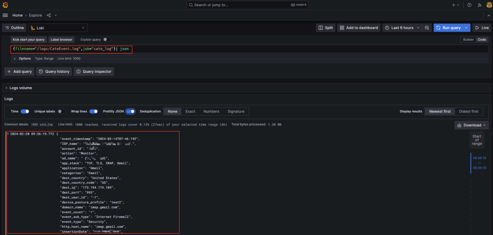
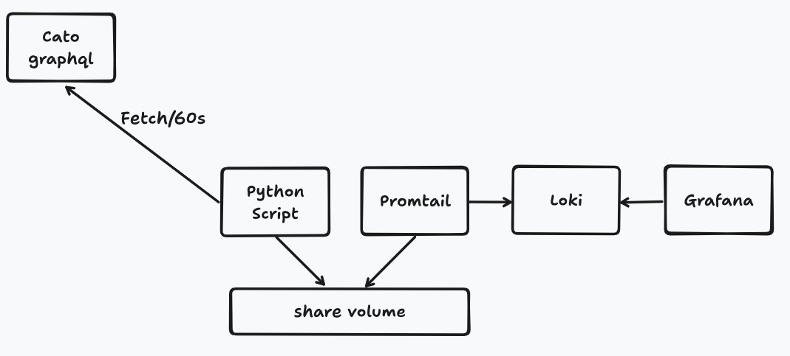
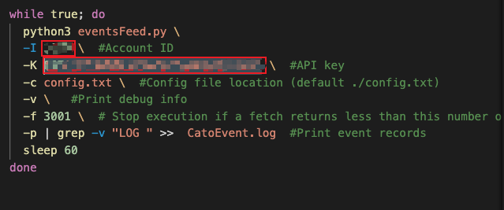
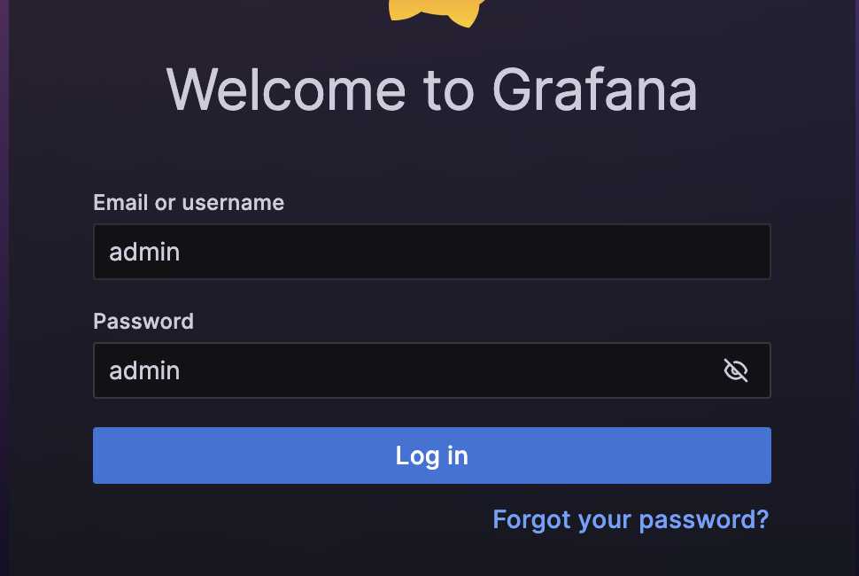
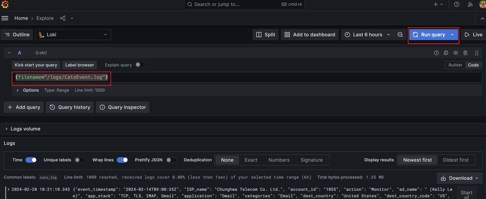

## Cato graphql api intergrate with Promtail-Loki-Grafana
This repository is use for quick start with the Cato eventsFeed API and intergrate the event record with loki-grafana.


Since Cato support log exporter until March 2024,
and provide below 3 solutions to export the events for your account:

1. Events Integration to push events to an AWS S3 bucket that belongs to your organization
2. eventsFeed API to query events to a SIEM solution 
3. auditFeed API to export the Audit Trail for your account

- [For accounts that are currently using the Log Exporter, you can continue using this feature until March 2024. After this time, you will no longer be able to use this feature to download log files from the Cato AWS S3 bucket. ](https://support.catonetworks.com/hc/en-us/articles/13315035656989-Product-Update-Sept-4th-2023)


## Requirement
1. docker && docker-compose && git
2. [Cato API key and CMA ID](https://support.catonetworks.com/hc/en-us/articles/4413280536081-Generating-API-Keys-for-the-Cato-API)
---
The log flow is as below

---

### Step 1 git clone the repo
```
git clone https://github.com/linhunghui/cato-api-intergrate-loki-Grafana.git
```

### Step 2 Put your API key and CMA ID in the ./cato/script.sh


Softly remind the option -f means Stop execution if a fetch returns less than this number of events (default=1) 

### Step 3 Start the docker compose
```
docker compose up -d
```

### Step 4 Check Grafana web ui on http://localhost:3000
- user : admin
- password : admin



### Step 5 Check the log on grafana
Grafana > Menu > Explore
Type {filename="/logs/CatoEvent.log"} on the query and run


### Step 6 Use LogQL to query events
Then you could use [LogQL](https://grafana.com/docs/loki/latest/query/) to query the event you need.

---
If you are still test or wanna refetch the event record plz do below command,because config.txt will storage the marker,so if you didn't clean the marker the script will start fetch from the marker.

```
docker compose down && echo "" > ./cato/CatoEvent.log && echo "" > ./cato/config.txt
```